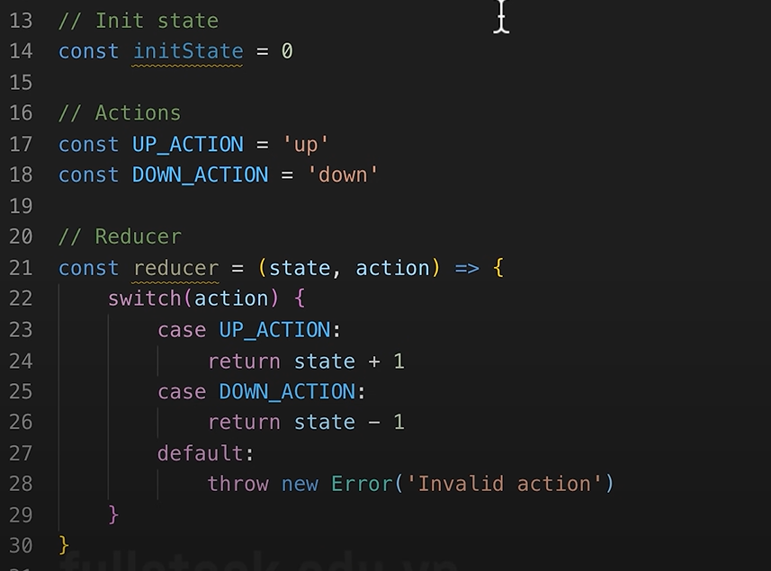
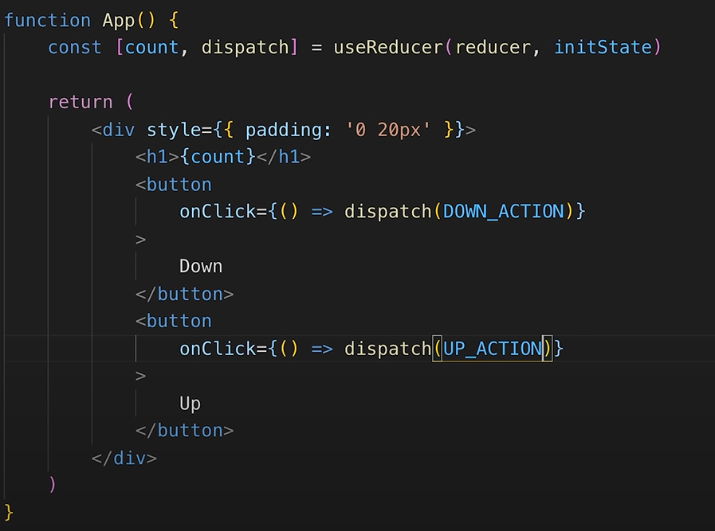

# Ôn CSS:

**FLEX:**
`.container {
display: flex;

flex-flow: row wrap;
flex-direction: row;
flex-wrap: wrap;

/_ can theo chieu ngang _/
justify-content: flex-start;

/_ can theo chieu doc _/
align-items: center;

/_ flex item _/
/\*

flex-basis: auto theo content / or px;
flex-grow: chiem khong gian kha dung ;
flex-shrink: khong gian kha dung la âm;

viet tat: flex: 1 1 1;

order: thay doi thu tu hien thi
\*/

}`

**GRID**
.container{
/_ GRIDS _/
display: grid;

/_ chia chieu dai cot - cot 1 300 - cot 2 200 | theo ti le: 1fr 1fr 1fr - repeat(3, 1fr)_/
grid-template-columns: 300px 1000px;
/_ hang | theo ti le: _/
grid-template-rows: 100px 200px;
/_ Xet chieu cao khi ko dung 'grid-template-rows' ma de tu dong rot xuong hang _/
/_ minmax(60px, auto) -> min, max _/
grid-auto-rows: 200px;

/_ grid-area: hình vuông hoặc HCN _/
grid-template-columns:
"aa aa aa"
"bb bb bb" ;

/_ tao khoang cach giua row hay column _/
column-gap: 10px;
row-gap: 10px;
}

.item-5{
/_ cot: chiem tu line 2 -> 4 _/
grid-column-start: 2;
grid-column-end: 4;
/_
grid-column: 2 / 4;
_/

/_ cot: chiem tu line 2 -> 4 _/
grid-row-start: 2;
grid-row-end: 4;
/_
grid-row: 2 / 5;
_/

/_ grid-area: hình vuông hoặc HCN _/
grid-area: aa;

`
.container{
/_ GRIDS _/
display: grid;

/_ chia chieu dai cot - cot 1 300 - cot 2 200 | theo ti le: 1fr 1fr 1fr - repeat(3, 1fr)_/
grid-template-columns: 300px 1000px;
/_ hang | theo ti le: _/
grid-template-rows: 100px 200px;
/_ Xet chieu cao khi ko dung 'grid-template-rows' ma de tu dong rot xuong hang _/
/_ minmax(60px, auto) -> min, max _/
grid-auto-rows: 200px;

/_ grid-area: hình vuông hoặc HCN _/
grid-template-columns:
"aa aa aa"
"bb bb bb" ;

/_ tao khoang cach giua row hay column _/
column-gap: 10px;
row-gap: 10px;
}

.item-5{
/_ cot: chiem tu line 2 -> 4 _/
grid-column-start: 2;
grid-column-end: 4;
/_
grid-column: 2 / 4;
_/

/_ cot: chiem tu line 2 -> 4 _/
grid-row-start: 2;
grid-row-end: 4;
/_
grid-row: 2 / 5;
_/

/_ grid-area: hình vuông hoặc HCN _/
grid-area: aa;

`

# Config:

npm create vite@latest
cd vite-project
npm install
npm run dev

# rsc

# Bài 6: Tìm hiểu JSX phần 2:

# Bài 9: Components là gì ?

chia nhỏ giao diện, tái sử dụng, dễ bảo trì

# Bài 10: Props là gì ?

- Properties: thuộc tính

# Bài 13: Rendering list

# Bài 16: Refactor code

- Tối ưu code lại

# Bài 17: Tìm hiểu props children

- Nằm ở giữa component

# Bài 20: State là gì ?

- state nằm trong component và có thể tùy chỉnh state đó

# Bài 21: stateless và stateful functional components

- stateless: ko dùng state
  `
function Toggle() {
   return 

;
}`
- stateful: có dùng state
  `function Toggle2() {
  const [count, setCount] = useState();
  return 

;
}`

1. enabling state: bật nó lên useState(initialize value)
2. initialize state: giá trị khởi tạo - useState(...) -> boolean, number, string, undefined, null, obj, {}
3. reading state:
4. update state:

- state changes -> re-render: cập nhật lại UI

# Bài 26: Những nguyên tắc khi sử dụng hook cần nắm

# Bài 27: Stale state là gì ?

- sau khoảng thời gian nào đó mới update value

# Bài 28: Thực hành game Tictactoe phần 1:

`
const props = {
  value:"X",
  onClick: () => true
}`

- Obj Detructuring:
  `const students = {
  name: "Uyen",
  age: 18
}`

const [name, age] = students;
console.log(name, age);

# Bài 33: Xử lý state phức tạp như thế nào ?

# Bài 34: Tìm hiểu useReducer

- dùng để quản lý state phức tạp, đặc biệt là khi có nhiều hành động khác nhau tác động lên state.
  // useState
  // 1. Init state: 0
  // 2. Actions: Up (state + 1) / Down (state 1)

  _-------------------------------------------------------------------_

  // useReducer
  // 1. Init state: 0
  // 2. Actions: Up (state + 1)/ Down (state - 1)
  // 3. Reducer
  // 4. Dispatch

// Init state
const initState = 0

// Actions
const UP_ACTION = 'up'
const DOWN_ACTION = 'down'

// Reducer
`
const reducer (state, action) => {
  switch (action) {
    case UP_ACTION:
      return state + 1
    case DOWN_ACTION:
      return state - 1
    default: throw new Error('Invalid action')
  }
}`

// Dispatch -> initState
`const [count, dispatch] = useReducer(reducer, initState)`

# Bài 37: React cập nhật state như thế nào ?

- State luôn bất biến: React không cho phép thay đổi trực tiếp giá trị state. Phải sử dụng setState hoặc setState hook.
- Cập nhật state bất đồng bộ: Nếu cần thao tác với giá trị cũ, sử dụng callback hoặc hàm bên trong setState.
- Không nên cập nhật trực tiếp state trong vòng lặp hoặc điều kiện; hãy luôn dùng cách chuẩn React cung cấp.

=> dùng callback

# Bài 40: Cài đặt và sử dụng Sass cơ bản

- `npm install node-sass@4.14.1`

- Nếu bạn cài node-sass bị lỗi thì thay vào đó cài sass thôi là được với lệnh này: `npm i sass`

# Bài 42: Cài đặt thư viện styled-components

`npm install styled-components --save` -> nếu lỗi coi video có fix

- https://styled-components.com/docs/tooling#babel-plugin : `npm install --save-dev babel-plugin-styled-components` xong làm tiếp trong link hdan
- https://dribbble.com/rachel48

# Bài 52: Giới thiệu và cài đặt tailwindcss

- cài đặt với Craco Tailwind Create-App: https://v2.tailwindcss.com/docs/guides/create-react-app

- cài đặt với Vite: https://tailwindcss.com/docs/guides/vite
  `npm create vite@latest vite-project -- --template react`
  `cd vite-project`

# Bài 52.2: Hướng dẫn sửa lỗi TailwindCSS không tạo ra class
- `npm install -g rimraf`
- `rimraf node_modules`
- `rimraf package-lock.json`